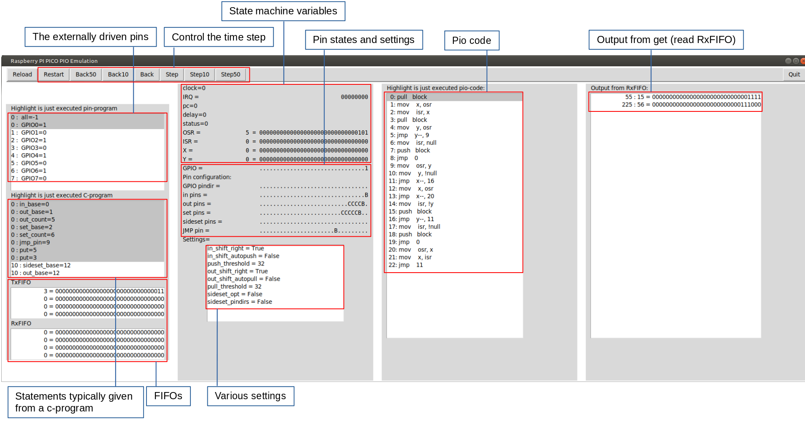

# Emulator of a Raspberry Pi Pico PIO state machine

## UPDATE
This emulator is far from perfect. Why not take a look at [WOKWI](https://wokwi.com/tools/pioasm), see e.g. the [HackadayU video](https://www.youtube.com/watch?v=LIA9wpt7N60) where it is used.

## What does it do
This code takes a .pio.h file generated by pioasm as input and emulates how a PIO state machine would execute it. The intended purpose is to gain insight in how it works to find bugs. 

Besides the .pio.h file, there are two more input files:
* a file describing the c-statements such as putting data into the Tx FIFO (c_program)
* a file describing the externally driven GPIO pins (pin_program)

The user can obtain insights into the workings of the pio code through a GUI which shows all (?) the relevant sm internal data such as registers.

For now this code only supports one state machine, of one PIO running one program.

## Workflow
When working on a project, I typically have an IDE (in my case vscode) with the project files, the pin_program and c_program files opened. Additionally, I have the emulator open with the .pio.h file of the project 

When changing the .pio code, I use the IDE function 'build' to have pioasm generate a new .pio.h file. Then I press Reload in the emulator, and study the emulation output.
When changing the c-code that uses the pio code, I have to decide if the c_program also needs to change. Often, this will not be the case because the c_program and pin_program act more like test cases than that they mimic the real c-code or real signals applied to the pins.

## Why?
The problem with the RPi Pico PIO state machines (sm) is that debuggers do not give the insight I need when writing code for a sm. I typically write some code, upload it to the pico and find that it doesn't do what I want it to do. Instead of guessing what I do wrong, I would like to see the values of e.g. the registers when the sm is executing.

And I liked making it. I know that there are others, e.g. a [java version](https://github.com/soundpaint/rp2040pio) (and I like their waveform output!). But I wanted to write my own, in Python.

## How does it work
After reading and parsing the input files, it emulates the sm (and the c-statements, and the externally driven GPIOs) for 500 steps, which can of course be changed in the python code, and stores all the state variables at each step into a list. Then the GUI is started which allows you to step back and forth through the results.

Run it with:
python3 main.py examples/multiplication/pio_program.pio.h examples/multiplication/pin_program examples/multiplication/c_program

After the emulation, this will produce a GUI much like in the image below.

## supported statements in .pio.h
In the .pio.h files generated by pioasm some c-statements are placed that are picked up by the emulator. The following information is used:
* #define tester_wrap_target
* #define tester_wrap
* the compiled statements in ..._program_instructions[]
* the .length and .origin in ..._program[]
* the  'sm_config_set_sideset' statement in ..._program_get_default_config[]
  * note: offset is not supported
  * setting wrap parameters is done using the #define statements mentioned above

## supported c-statements
The currently supported c-statements in the file c-program are:
* set_base, set_count
* out_base, out_count
* sideset_base, and the following are set by parsing the .pio.h file: sideset_count, sideset_opt, sideset_pindirs
* in_base
* jmp_pin
* out_shift_right, out_shift_autopull, pull_threshold
* in_shift_right, in_shift_autopush, push_threshold
* put, get, get_pc

## supported pin-program statements
The currently supported pin_program statements are:
* GPIO
* all

## What does not yet work, what could be improved, does it contain bugs?
Lots of things; Lots of things; Yes, be warned!

* not all functionality is implemented (search for TODO: in the code), and what is implemented may be buggy and inefficient
* unintuitive GUI 
* currently it only does one PIO and one sm (while the RPI Pico has 2 PIOs with 4 sm each), and one pio program in the memory
  * For now, I've chosen to only support one sm in one PIO with one program
* allow uncompiled code as pio programme, instead of the pioasm compiled code
  * I've chosen not to do this, see 'Workflow' above, instead I've made a 'Reload' button
* highlight the changed values when stepping through the emulation results
* if a GPIO is set/read by the code, there is no check if it really is an output/input; GPIO PINDIRS needs to be improved
* the priority of pin mapping (datasheet 3.2.5 Pin Mapping) is not taken into account
* there are accessible 30 GPIOs, but here there are 32

## Examples
I have included a number of examples to show that it works. For an explanation I refer to:
* [button debounce](https://github.com/GitJer/Some_RPI-Pico_stuff/tree/main/Button-debouncer)
* [multiplication](https://github.com/GitJer/Some_RPI-Pico_stuff/tree/main/multiplication)
* [rotational shift](https://github.com/GitJer/Some_RPI-Pico_stuff/tree/main/Rotational_shift_ISR)
* [square wave](https://datasheets.raspberrypi.org/rp2040/rp2040-datasheet.pdf), the RP2040 Datasheet
* [stepper motor](https://www.youtube.com/watch?v=UJ4JjeCLuaI) by Tinker Tech Trove
* side_step
* in_shift
